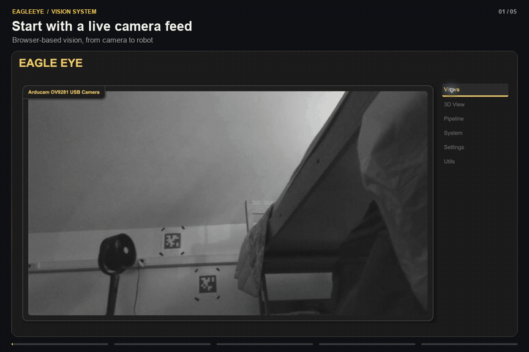

# EagleEye Vision System

EagleEye is a configurable robotics vision system for AprilTag localization and object detection. It runs multiple cameras and pipelines on Linux hardware, with a WebUI for setup and a robot-side NetworkTables library.



## Documentation

The [EagleEye documentation site](https://scythe-engineering.github.io/EagleEye-Docs/) contains installation, camera setup, pipeline configuration, robot integration, troubleshooting, developer documentation, and benchmark workflows.

- [Install EagleEye](https://scythe-engineering.github.io/EagleEye-Docs/docs/user-guide/install)
- [Build an AprilTag pipeline](https://scythe-engineering.github.io/EagleEye-Docs/docs/user-guide/pipeline-setup)
- [Add EagleEye to robot code](https://scythe-engineering.github.io/EagleEye-Docs/docs/user-guide/robot-integration)
- [Developer docs](https://scythe-engineering.github.io/EagleEye-Docs/docs/codebase/overview)

## Development

```bash
uv sync
uv run pytest -q tests
npm run build
```

See the [testing guide](https://scythe-engineering.github.io/EagleEye-Docs/docs/codebase/testing) for test markers and hardware-specific checks.

## License

EagleEye Vision System is licensed under the [PolyForm Noncommercial License 1.0.0](https://polyformproject.org/licenses/noncommercial/1.0.0). See [`LICENSE`](LICENSE) for the full terms.
